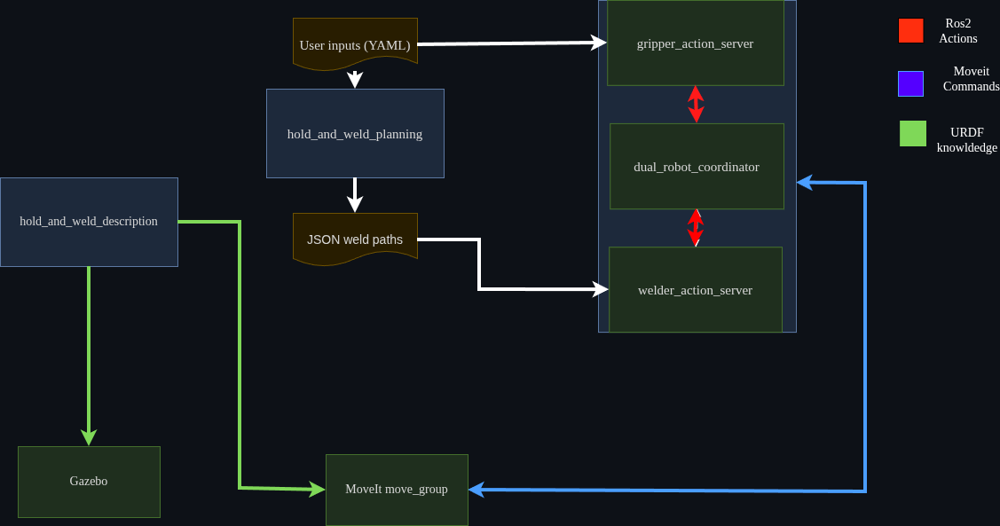

# Hold and Weld

ROS 2 framework for automated dual-arm robotic welding systems that perform holding and welding simultaneously.

## Overview

A modular system for coordinating gripper and welding robots to autonomously manipulate and weld
workpieces. This repository currently targets **ROS 2 Jazzy**.

## Features

- Automated weld path generation from seam geometry and saving that as a json file
- Dual-robot coordination with collision avoidance
- Action-based architecture for flexible workflows
- Support for multiple joint types (T-joint, butt-joint, corner joint, lap joint, edge joint)

## Architecture



## Packages

- **hold_and_weld_description** - Robot URDFs, meshes, and models
- **hold_and_weld_planning** - Python tools for weld path generation and geometry processing
- **hold_and_weld_application** - C++ action servers and workflow coordination

## Design Philosophy

This project is designed with the following principles in mind:

- **Separation of concerns**
  Planning, description, and application logic are split into independent packages to allow
  iteration and testing without cross-coupling.

- **Action-driven orchestration**
  Long-running and stateful robot operations are modeled as ROS 2 actions to support
  feedback, cancellation, and extensibility.

- **Simulation-first development**
  All core functionality is designed to be testable in simulation before deployment on real hardware.

- **Robot-agnostic extensibility**
  The system aims to support different robot models and configurations with minimal code changes,
  relying on URDF and configuration files rather than hardcoded assumptions.

- **Incremental autonomy**
  Advanced components such as geometry reasoning and behavior trees are introduced progressively,
  only after a stable execution pipeline is established.


## 🚀 Planned Milestones

### Milestone 1 – Core Stability
- [ ] Realistic models for external-axis torch and gripper
- [ ] Action server for moving a robot to a target pose
- [ ] Test coverage for all supported weld joint types

### Milestone 2 – Configuration & Extensibility
- [ ] YAML-based configuration system
- [ ] Pilz and IKFast integration
- [ ] Guidelines for adding robots and jobs

### Milestone 3 – Advanced Autonomy
- [ ] URDF-driven geometry engine
- [ ] Behavior Tree–based task orchestration

## Conceptual Design Notes (Future Work)

This section documents design considerations and architectural directions explored during development and is not a commitment to specific implementations.


### Geometry Engine

Currently seam geometry is created by yaml inputs and it requires user to enter values like:
seam geometry, surface normal and surface center etc. Main purpose of geometry engine will
be calculating how to give work, travel angel and requested gap with processing urdf or stl.
User will only be giving seam lines relative to the world frame.

A similar mechanic can be used for gripper. Currently gripper needs input of 4 phase sequence
and open close positions. Geometry engine will help user to create a physical road that will
avoid collision.

### Behavior Tree

Currently there is a `dual_robot_coordinator` node that is responsible for orchestrating nodes.
A behavior tree integration and making current action servers, node will help user to create
multiple step, arbitrary number of robot and object scenes. On top of this a behavior tree can
help user to create conditional check nodes to avoid failure situations of real life like a
gripping failure mid mission.

## Known Issues

- Currently gripper system is showing inconsistencies due to model problems.
- JSON system can create problems that can be solved by building from cache after creating json. This problem
will be solved by adding json parserer independent from colcon.

## Quick Start
```bash
# Build
colcon build --packages-up-to hold_and_weld_application

# Generate weld path
ros2 run hold_and_weld_planning generate_weld_path

# Run simulation
ros2 launch hold_and_weld_application simulation.launch.py
```

## License

Apache-2.0

## Author

Berkan Tali (berkantali23@outlook.com)
GitHub: @silanus23
