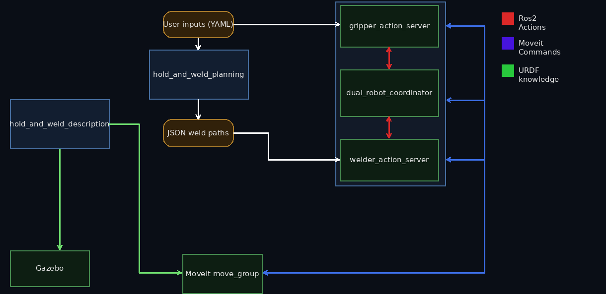
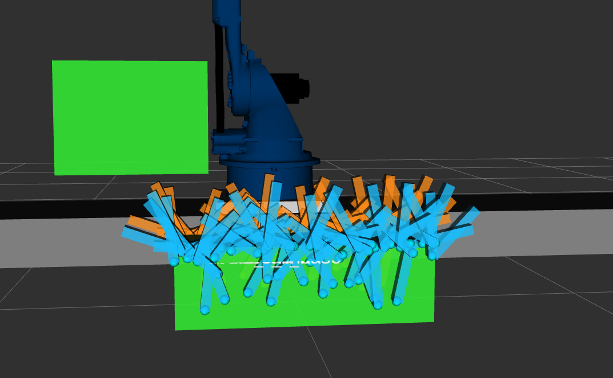
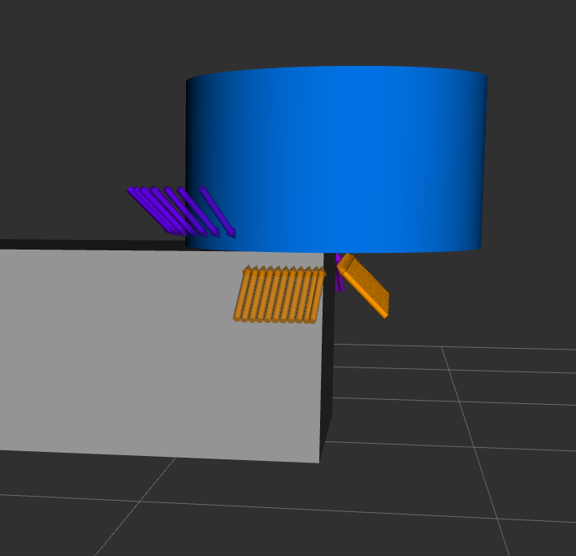

# Hold and Weld

**A ROS 2 framework for automated dual-arm robotic welding systems that perform holding and welding simultaneously with integrated grasp sampler and weld finder. Currently at PoC stage. Targets ROS 2 Jazzy.**


## Packages

- [`hold_and_weld_description`](hold_and_weld_description) — robot URDFs, meshes, and models
- [`hold_and_weld_planning`](hold_and_weld_planning) — weld path generation and seam extraction
- [`hold_and_weld_gripper_sampler`](hold_and_weld_gripper_sampler) — constraint-aware grasp sampling
- [`hold_and_weld_application`](hold_and_weld_application) — action servers and workflow coordination
- [`hold_and_weld_bringup`](hold_and_weld_bringup) — launch files and system bringup

## Architecture



## Capabilities
- Weld seam extraction from CAD and mesh geometry
- Constraint-aware grasp sampling on exact CAD surfaces
- Dual-arm coordination connecting both into an executable workcell


## Results

**Grasp candidates example generated by `hold_and_weld_gripper_sampler`:**



**Weld seam extraction example via the mesh pipeline in `hold_and_weld_planning`:**



## Quick Start

## Dependencies
- [OpenCASCADE 7.9.3](https://github.com/Open-Cascade-SAS/OCCT/tree/OCCT-793)
- CGAL
- FCL
- MoveIt 2

**2. Build the mesh intersection extension**

```bash
cd hold_and_weld_planning/hold_and_weld_planning/mesh
mkdir build && cd build
cmake ..
make
cp mesh_intersection*.so ../
```

**3. Launch the system**

```bash
ros2 launch hold_and_weld_bringup system_bringup.launch.py
```

For adding a new robot to the workcell see [ADDING_A_ROBOT.md](ADDING_A_ROBOT.md).
For the development roadmap see [ROADMAP.md](ROADMAP.md).

## References

Duff, T., Burgess, B., & Hery, C. (2017). Building an orthonormal basis, revisited.
*Journal of Computer Graphics Techniques (JCGT)*, 6(1), 1–8.

Robot meshes from Yaskawa Motoman's [motoman_ros2_support_packages](https://github.com/ros-industrial/motoman) (Apache 2.0 / BSD 3-Clause). Thanks Yaskawa.
