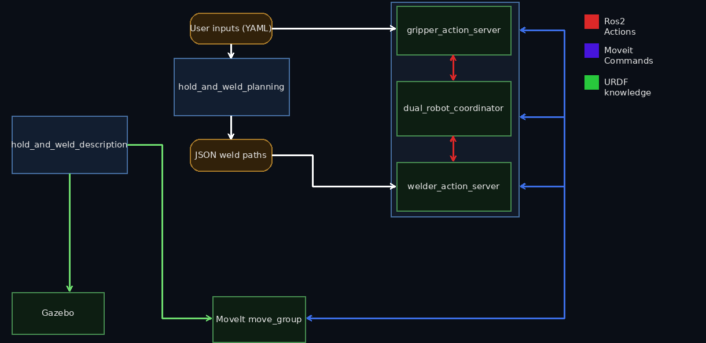
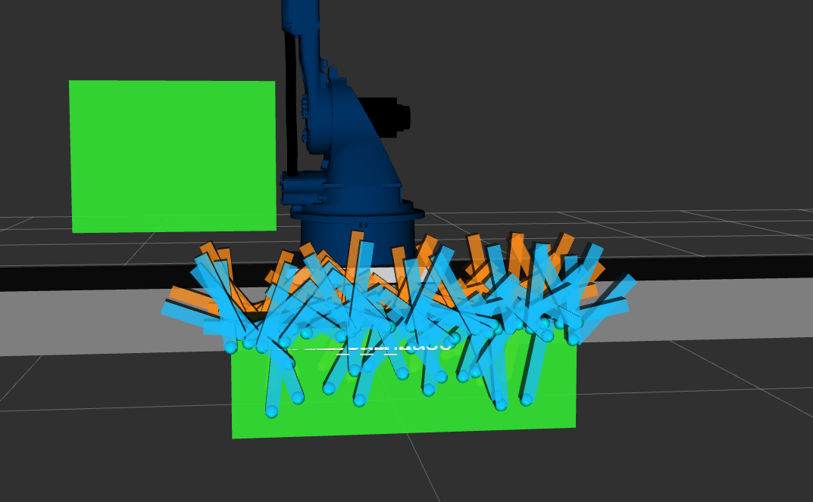
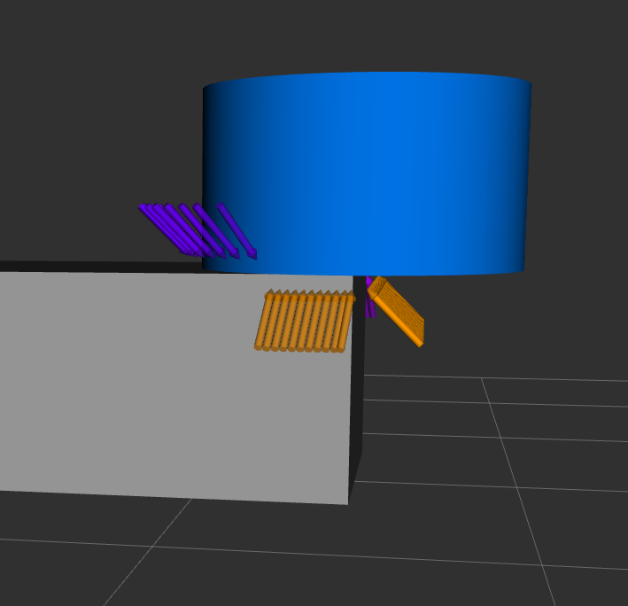

# Hold and Weld

**A ROS 2 framework for automated dual-arm robotic welding systems that perform holding and welding simultaneously with integrated grasp sampler and weld finder. Currently at PoC stage. Targets ROS 2 Jazzy.**

https://github.com/user-attachments/assets/5dadf27f-0fd4-468e-813c-f0a223d694ed

## Packages

- [`hold_and_weld_description`](hold_and_weld_description) — robot URDFs, meshes, and models
- [`hold_and_weld_planning`](hold_and_weld_planning) — weld path generation and seam extraction
- [`hold_and_weld_gripper_sampler`](hold_and_weld_gripper_sampler) — constraint-aware grasp sampling (eliminating surfaces and regions including weld lines)
- [`hold_and_weld_application`](hold_and_weld_application) — action servers and workflow coordination (including custom kinematic solvers)
- [`hold_and_weld_bringup`](hold_and_weld_bringup) — launch files and system bringup (including visualizers and single spawners)

Key packages have detailed READMEs.

## Architecture



## Capabilities
- Weld seam extraction from CAD and mesh geometry
- Constraint-aware grasp sampling on exact CAD surfaces
- Dual-arm coordination connecting both into an executable workcell


## Results

**Grasp candidates example generated by `hold_and_weld_gripper_sampler`:**



**Weld seam extraction example via the mesh pipeline in `hold_and_weld_planning`:**



## Quick Start

Ubuntu 24.04 with ROS 2 Jazzy. The repo is expected at `<ws>/src/hold_and_weld`.

**1. ROS and system dependencies**

MoveIt 2, Gazebo, Ceres, FCL, Embree and the rest come from rosdep:

```bash
cd <ws>
rosdep install --from-paths src --ignore-src -y
```

**2. Python dependencies**

```bash
pip install --user --break-system-packages -r src/hold_and_weld/requirements.txt
```

**3. OpenCASCADE 7.9.3 and pythonocc-core 7.9.0**

These are built from source: apt only ships OCCT 7.6, and pythonocc-core is not on pip.
pythonocc-core must be built against the same OCCT.

```bash
sudo apt install cmake swig python3-dev tcl-dev tk-dev libfreetype-dev \
  libgl1-mesa-dev libxi-dev libxmu-dev

git clone --depth 1 -b V7_9_3 https://github.com/Open-Cascade-SAS/OCCT.git
cmake -S OCCT -B OCCT/build -DCMAKE_BUILD_TYPE=Release \
  -DCMAKE_INSTALL_PREFIX=$HOME/tools/occt_7.9.3
cmake --build OCCT/build -j$(nproc) && cmake --install OCCT/build

git clone --depth 1 -b 7.9.0 https://github.com/tpaviot/pythonocc-core.git
cmake -S pythonocc-core -B pythonocc-core/build -DCMAKE_BUILD_TYPE=Release \
  -DOCCT_INCLUDE_DIR=$HOME/tools/occt_7.9.3/include/opencascade \
  -DOCCT_LIBRARY_DIR=$HOME/tools/occt_7.9.3/lib \
  -DPYTHONOCC_INSTALL_DIRECTORY=$(python3 -m site --user-site)/OCC
cmake --build pythonocc-core/build -j$(nproc) && cmake --install pythonocc-core/build
```

Add to your shell rc, so CMake and the runtime find OCCT:

```bash
export CASROOT=$HOME/tools/occt_7.9.3
export CMAKE_PREFIX_PATH=$CASROOT:$CMAKE_PREFIX_PATH
export LD_LIBRARY_PATH=$CASROOT/lib:$LD_LIBRARY_PATH
```

**4. Build**

```bash
colcon build --symlink-install
source install/setup.bash
```

**5. Launch the system**

```bash
ros2 launch hold_and_weld_bringup system_bringup.launch.py
```

For adding a new robot to the workcell see [ADDING_A_ROBOT.md](ADDING_A_ROBOT.md).
For the development roadmap see [ROADMAP.md](ROADMAP.md).

## References

Duff, T., Burgess, B., & Hery, C. (2017). Building an orthonormal basis, revisited.
*Journal of Computer Graphics Techniques (JCGT)*, 6(1), 1–8.

Robot meshes from Yaskawa Motoman's [motoman_ros2_support_packages](https://github.com/ros-industrial/motoman) (Apache 2.0 / BSD 3-Clause). Thanks Yaskawa.
