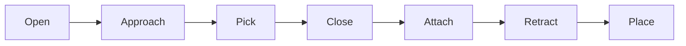

# hold_and_weld_application

The application layer of the hold and weld system. Responsible for robot motion execution, coordination, and kinematic validation. Consumes weld path `JSON` from `hold_and_weld_planning` and grasp configurations to drive the physical dual-robot sequence.

## Coordinator

A temporary placeholder until behavior tree node implementation. The coordinator's responsibility is triggering the gripper and welder action servers and enforcing sequential execution between them — gripper job must complete before the welder job begins. It monitors controller availability on startup and supports both automatic and manual trigger modes via a service interface.

## Action Servers

Currently two active servers: the gripper action server and the welder action server. Both are robot agnostic — which robot they control is defined entirely by parameters, making them reusable across different hardware configurations.

Both servers are implemented as ROS 2 lifecycle action servers. Lifecycle nodes were chosen because they provide cleaner launch control, healthier initialization ordering, and will make the future behavior tree transition significantly easier. MoveIt 2's internal architecture does not currently support lifecycle node interfaces, which required workaround layers in both servers. There are no active functional problems but making the shutdown process fully clean is under active investigation.

### Gripper Action Server

Handles the complete pick and place sequence. Object attachment and allowed collision matrix updates are managed automatically during execution. Job configuration is loaded from `YAML` at configure time. Currently uses a fixed 7-stage linear pipeline with no error recovery between stages. A more autonomous approach is under investigation.

### Welder Action Server

Handles weld seam execution. Reads weld path `JSON` produced by `hold_and_weld_planning`, approaches each seam, executes the Cartesian path via MoveIt, and retracts. Approach validation via the kinematics stack runs before each seam execution to ensure the approach configuration can walk the full seam without singularities or joint flips.

## Kinematics

A custom kinematics stack built independently of MoveIt's IK infrastructure to support approach validation without depending on the MoveIt planning pipeline at validation time. Google Ceres was chosen over simpler iterative solvers deliberately — the optimization framework is the foundation for the planned pose finder and supports collision-aware cost terms in future extensions, which local iterative solvers cannot provide.

`URDFParser` extracts the kinematic chain directly from the robot description, separating actuated joints from fixed tool transforms. Accepts both file paths and raw URDF strings, allowing it to consume the `robot_description` parameter directly from the parameter server without filesystem access.

`KinematicsSolver` provides forward kinematics, geometric Jacobian computation, Yoshikawa manipulability index, and joint limit checking for the extracted chain.

`CeresIKSolver` wraps Google Ceres to solve inverse kinematics numerically with warm starting. A seed penalty term keeps solutions near the previous configuration, preventing joint flips along a trajectory. Hard joint limits are enforced via Ceres parameter bounds.

`ApproachValidator` uses the above three components to perform a static walk along the weld seam from a candidate approach configuration. Starting from an OMPL-generated approach joint state, it incrementally solves IK for each seam waypoint using the previous solution as seed, checking manipulability at each step. Phase one uses relaxed tolerances since the OMPL result may be far from the first seam point in joint space. Phase two uses tight tolerances since it warm starts from the previous solution. If any waypoint fails IK convergence or falls below the manipulability threshold, the approach configuration is rejected and OMPL replans.

## Known Limitations

- MoveIt 2 does not currently support lifecycle node interfaces. Both action servers require an internal node bridge layer as a workaround. Shutdown produces error output from MoveIt 2's internal nodes as the ROS 2 context tears down — this originates inside MoveIt 2 and is not suppressible from the application layer.
- Single goal queue per server. A second goal arriving during active execution will be queued in the single slot. Explicit rejection of concurrent goals is planned.
- Gripper action server uses a fixed 7-stage linear pipeline with no error recovery between stages. A flexible state machine approach is planned as part of the behavior tree transition.
- Approach validator has been tested on GP25 geometry. Validation behavior on significantly different manipulator geometries has not been verified.
