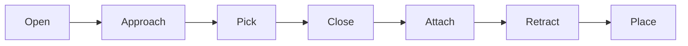

# hold_and_weld_application

The application layer of the hold and weld system. Responsible for robot motion execution, coordination, and kinematic validation. Consumes weld path `JSON` from `hold_and_weld_planning` and grasp configurations to drive the physical dual-robot sequence.

## Coordinator

A temporary placeholder until behavior tree node implementation. The coordinator's responsibility is triggering the gripper and welder action servers and enforcing sequential execution between them — gripper job must complete before the welder job begins. It monitors controller availability on startup and supports both automatic and manual trigger modes via a service interface.

## Action Servers

Currently two active servers: the gripper action server and the welder action server. A third, `move_to_pose_server`, is built but not launched; it is a placeholder awaiting a proper implementation (see `ROADMAP.md`). The two active servers are robot agnostic — which robot they control is defined entirely by parameters, making them reusable across different hardware configurations.

Both servers are implemented as ROS 2 lifecycle action servers. Lifecycle nodes were chosen because they provide cleaner launch control, healthier initialization ordering, and will make the future behavior tree transition significantly easier. MoveIt 2's internal architecture does not currently support lifecycle node interfaces, which required workaround layers in both servers. There are no active functional problems but making the shutdown process fully clean is under active investigation.

### Gripper Action Server

Handles the complete pick and place sequence. Object attachment and allowed collision matrix updates are managed automatically during execution. Job configuration is loaded from `YAML` at configure time. Currently uses a fixed 7-stage linear pipeline with no error recovery between stages. A more autonomous approach is under investigation.

```mermaid
flowchart LR
    A[Open] --> B[Approach] --> C[Pick] --> D[Close] --> E[Attach] --> F[Retract] --> G[Place]
```

### Welder Action Server

Handles weld seam execution. Reads weld path `JSON` produced by `hold_and_weld_planning`, approaches each seam, executes the Cartesian path via MoveIt, and retracts. `ConfigurationFinder` picks the approach configuration before each seam so the full seam can be walked without singularities or joint flips. Loading is best effort: a malformed pose is dropped (its seam is reported as partial), a seam left without enough poses is skipped, and the rest of the file is welded; the result message lists skipped and partial seams. Seams run in seam-id string order (`seam_10` before `seam_2`).

## Kinematics

A custom kinematics stack built independently of MoveIt's IK infrastructure to support approach validation without depending on the MoveIt planning pipeline at validation time. Google Ceres was chosen over simpler iterative solvers deliberately — the optimization framework is the foundation for `ConfigurationFinder` and supports collision-aware cost terms in future extensions, which local iterative solvers cannot provide.

`URDFParser` extracts the kinematic chain directly from the robot description, separating actuated joints from fixed tool transforms. Accepts both file paths and raw URDF strings, allowing it to consume the `robot_description` parameter directly from the parameter server without filesystem access.

`KinematicsSolver` provides forward kinematics, geometric Jacobian computation, Yoshikawa manipulability index, and joint limit checking for the extracted chain.

`CeresIKSolver` wraps Google Ceres to solve inverse kinematics numerically with warm starting. A seed penalty term keeps solutions near the previous configuration, preventing joint flips along a trajectory. Hard joint limits are enforced via Ceres parameter bounds.

`ApproachValidator` (legacy, superseded by `ConfigurationFinder`; only used when `use_approach_validation` is on and the finder is off) uses the above three components to perform a static walk along the weld seam from a candidate approach configuration. Starting from an OMPL-generated approach joint state, it incrementally solves IK for each seam waypoint using the previous solution as seed, checking manipulability at each step. Phase one solves the first seam point with relaxed pose tolerances. Phase two walks the remaining points with tight tolerances, each warm started from the previous solution. If any waypoint fails IK convergence or falls below the manipulability threshold, the approach configuration is rejected and OMPL replans.

`ConfigurationFinder` (welder, on by default via `use_configuration_finder`) picks the joint configuration the Pilz weld starts from *before* OMPL runs. It enumerates the IK solutions at the approach standoff: Ceres multi-start from the home configuration, then the exact wrist flip and every in-limit J4/J6 2π copy. For each one it simulates the path Pilz will execute (LIN plunge, then LIN/CIRC or the dense-waypoint fallback), with warm-started IK. A candidate is rejected on IK failure, joint limits, low manipulability, or a joint step large enough to trip Pilz's velocity check. Survivors are ranked by limit margin, manipulability, and distance from home, and OMPL plans to the best one as a joint goal. The same seam therefore always welds from the same configuration. Tunables live under `finder:` in `hold_and_weld_bringup/config/tasks/welding.yaml`. When the finder is enabled, `ApproachValidator` is not used on the approach. With `use_pilz: false` every seam is welded through `computeCartesianPath` over its dense poses (the path `ptp` seams always take); the finder's simulated path still matches, since that is also a straight plunge followed by the seam poses.

## Known Limitations

- MoveIt 2 does not currently support lifecycle node interfaces. Both action servers require an internal node bridge layer as a workaround. Shutdown produces error output from MoveIt 2's internal nodes as the ROS 2 context tears down — this originates inside MoveIt 2 and is not suppressible from the application layer.
- One goal at a time per server. A goal arriving while another is queued or running is rejected.
- Gripper action server uses a fixed 7-stage linear pipeline with no error recovery between stages. A flexible state machine approach is planned as part of the behavior tree transition.
- Approach validator (legacy) has been tested on GP25 geometry. Validation behavior on significantly different manipulator geometries has not been verified.
