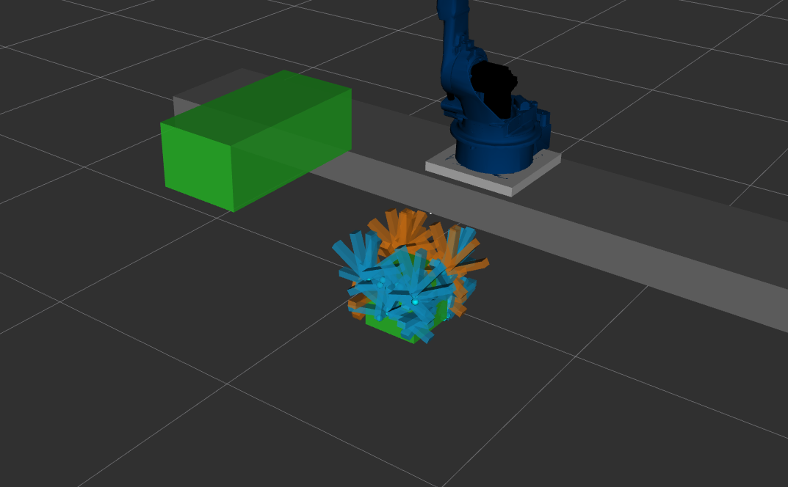
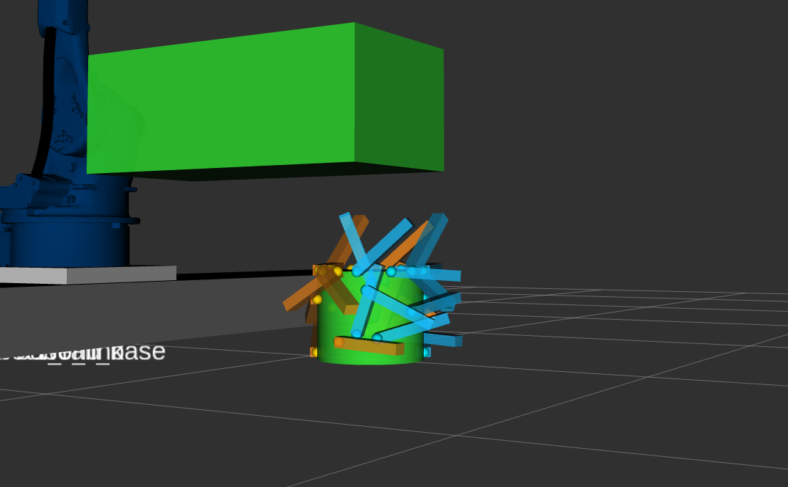

# hold_and_weld_gripper_sampler

A deterministic, constraint-aware grasp sampling library for parallel jaw grippers.
Built on OpenCASCADE (OCCT) for geometrically exact CAD surface operations with FCL
and Embree for collision checking. Unlike conventional samplers, sampling areas are
defined and constrained before the sampling phase, allowing solutions with hard
geometric and environmental requirements. Contact points are computed on actual CAD
surfaces giving geometrically exact results. Currently supports CAD-based geometry
input only.

## Pipeline

### Geometry Mapper

The entry point for CAD geometry into the pipeline. Loads workpiece geometry
from URDF or STEP files and extracts full topology — surfaces, edges, and corners
with their connectivity relationships. The resulting topology and face map are
used throughout the pipeline.

### Shape Refiner

The nature of the sampling pipeline and CAD file geometry require surfaces to be
divided in order to create more opposing surface candidates. Shape Refiner handles
this with a three policy approach: U-periodic surface splitting (surfaces that wrap
around a closed axis such as full cylinders or cones, split along the periodic
direction before other processing), arc length based splitting, and area ratio
based splitting.

In addition it removes enclaves — small surface features that would confuse the
sampling pipeline without contributing meaningful grasp candidates in real
applications. Shape healing is also applied at this stage before the refined
geometry is passed downstream.

### Contact Sampler

A configurable antipodal contact pair finder with filter and constraint awareness.
It considers limitations coming from overlap areas of constraints and filter
evaluations before sampling, ensuring only valid surface regions are sampled.
Uses a grid based approach to achieve broad coverage without generating redundant
clustered pairs.

### Angle Finder

Approach direction validity is determined here. Implemented in four phases.

Phase one builds a radial surface map around each contact point by casting
classification rays in decreasing rings starting from finger length radius down to
finger radius. Each ray classifies the surrounding surface as flat, elevated, or a
graspable cliff. This analysis drives approach direction candidates.

Phase two clusters the candidates, scores them by grippable arc fraction, and
applies randomization to diversify the result set.

Phase three runs full collision checks against the primary shape and exclusion zones
via FCL and Embree. This is the second point in the pipeline where constraints
directly influence results, the first being the Contact Sampler.

Phase four performs self-collision checks against secondary shapes as a separate step.

Candidates surviving all four phases are returned as grasp candidates for downstream
processing.

## Plugin System

### Filters

Eliminates ungraspable surfaces or parts of surfaces before the sampling phase
to avoid wasted computation on invalid grasp candidates. Surface filters operate
on whole surfaces, region filters operate on areas within surfaces.

Currently base classes and interfaces are defined but pipeline integration is
planned.

### Constraints

Limits or eliminates surfaces from sampling using 3D collision volumes. Unlike
filters, constraints construct 3D shapes and determine forbidden areas from their
collision geometry. The same shapes serve dual purpose — defining forbidden
sampling regions and acting as collision objects during the Angle Finder phase.

Constraints can represent real objects like ground planes and fixtures or mission
specific forbidden zones like weld seams and screw holes.

## Jaw Clearance

Not a plugin and not a constraint — it owns no geometry and contributes nothing to
the sampling regions. It is a pose-time collision test: `JawClearanceCheck`, in
`collision/`, beside the FCL checker it calls.

The collision checks in the Angle Finder test the gripper solid, so they cannot see
into the mouth — the open space between the two fingers, where the gripper is
precisely *not*. No tolerance makes them see it, because there is no gripper surface
there to measure from.

The jaw-clearance check covers that region with a cylinder on the jaw axis, ending
at the TCP: radius `grip_distance / 2 + jaw_clearance.clearance_margin`, length
`orientation.finger_length`. A candidate is eliminated when a secondary shape or an
exclusion volume sits in or beside the mouth. It runs before the exact mesh check, so
the candidates it kills cost nothing further.

Two things are deliberately left out:

- **The gripped workpiece.** The TCP is the midpoint of the two contacts, so it lies
  inside the material; the part is in the cylinder for every candidate by construction.
  Geometry on the part itself is the radial map's job.
- **The ground.** It is already checked against real gripper geometry, and a round
  volume over-approximates the jaws badly against an infinite halfspace — with the
  ground included, cube grasps dropped from 4592 to 3271 with no obstacle in the scene.

## Results

**Grasp candidates example generated by `hold_and_weld_gripper_sampler`:**





## Quick Start

```bash
ros2 run hold_and_weld_gripper_sampler grasp_finder_node --config <path_to_yaml>
```

See `config/grasp_finder_example.yaml` for a fully documented configuration example
covering all supported workpiece types and constraint configurations.

The output JSON carries visualization geometry alongside the grasps themselves: a
top-level `constraint_geometry` block (exclusion zones only — secondary/fixture
shapes are deliberately not included, since `step`/`urdf` secondaries can be
arbitrary CAD geometry with no primitive worth writing) and, per grasp, the
jaw-clearance cylinder it was tested against — see `PARAMS.md`'s "Visualization
fields" section for the exact layout. `hold_and_weld_application`'s
`finger_visualizer.py` consumes this to publish RViz2 markers.

## Known Limitations

- CAD geometry input only. Mesh and point cloud support is planned.
- Parallel jaw grippers only. Other gripper types are not supported.
- Tested on box, prism, and small cylinder workpieces. Complex organic geometry
  is not yet validated.
- Ground plane rejection uses a halfspace model. Smart ground detection based on
  workpiece topology is planned.
- Filter pipeline is defined but not yet wired into the active pipeline.
- Asymmetric gripper opening not supported. Both fingers are assumed to travel
  equal distances from closed position.
