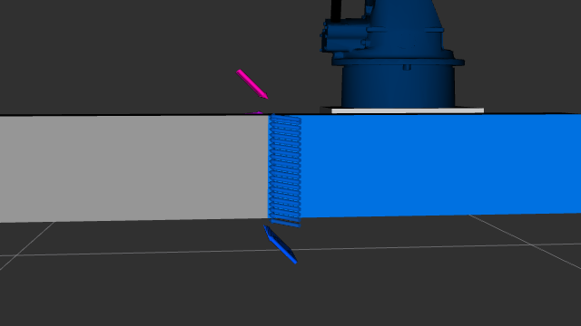
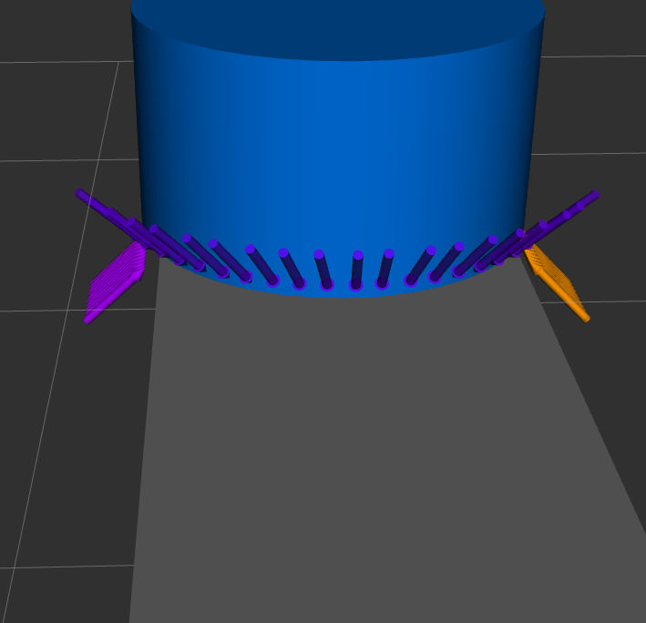

# hold_and_weld_planning

A weld path creator for 6 DOF robots. Built on OCCT, manifold3d, trimesh and scipy.
The current architecture assumes the region where two parts meet can be located
reliably — as exact intersection edges in CAD, or as a contact boundary in mesh.
Weld joint type (butt, fillet, lap) does not affect the planner since it operates purely
on geometry outputs — any joint type is handled correctly given valid geometric values
from the seam extraction side. Outputs weld paths as `JSON`.

Regarding seam extractors: the OCCT-based extractor is more deterministic by nature of
exact CAD representations, while the mesh-based extractor remains sensitive to parameters.
See [ROADMAP.md](../ROADMAP.md) for further improvements to handle more complicated setups.

## Core

The fundamental objects that seam extractors provide to the planner. This package exposes
these objects directly, allowing custom logic without rebuilding the full pipeline.

## Planner

Two planners are provided. The job planner is a classical base pipeline that provides
connection to each class. The weld planner is the standardized planner — its intake is
Core class objects and it produces standardized `JSON` outputs based on given parameters
and seam extractors. It has two modes — edge to edge and edge to surface — determined
automatically by the seam extractor output.

## Seam Extractors

### Mesh

Seam extractor for mesh inputs. Meshes carry no exact intersection curve, so the seam
is found as the boundary of the region where the two parts touch. Core objects need:
contact type, which side of the seam is surface and which is edge, and normals around
each point.

The pipeline: mark every face whose centroid lies within `epsilon` of the other mesh,
take the edges bounding that marked set, and keep those that follow a real part edge —
a sharp edge that also sits on the other mesh, so a part's own rim away from the joint
is not welded. Those edges are chained into loops per mesh, pooled, and stitched across
meshes, since each part contributes only the stretch where it terminates.

Seam points then start life as mesh vertices, which caps the seam at the tessellation.
A coverage field recovers the rest: around each point the other mesh's triangles are
weighted by distance and by how squarely they oppose the mating surface, normalised so
the field reads 1 inside the contact, 0 outside and 1/2 on the boundary. The boundary is
that half level set, solved by bisection between vertices.

Ownership — which mesh carries the geometric edge — is read per POINT, never per chain,
because it alternates wherever a part overhangs. It is a comparison of each mesh's
distance to its own nearest sharp edge, with no absolute threshold; genuine ties are
broken on turning density, `sum(dihedral * edge_length) / sum(face area)` over a ball,
which is conserved under retriangulation and so separates a real part edge from a merely
tessellated curve.

Classification into LINE, ARC and PTP is a tolerance cascade in `path_creator.py`, not a
best-fit contest — see PARAMS.md.

### OCCT

Seam extractor for CAD inputs. Uses exact face-pair proximity detection via
`BRepExtrema_DistShapeShape` to find kissing surfaces, then `BRepAlgoAPI_Common` to
extract exact intersection edges. For each intersection edge, wall surfaces are selected
based on whether a real boundary edge exists on the kissing face. Normals are evaluated
directly from OCCT surface properties at each point; whichever part has a real boundary
edge on the seam supplies the wall normal, and the other carries the base surface. The
geometry is exact and only `epsilon` and `num_smooth_points` are read, so it is far less
parameter-sensitive than the mesh pipeline — but it is not judgement-free, and it has no
tests of its own. Pipe joint detection is under development.

## Results

**Weld seam extraction example via the mesh pipeline:**

## Known Limitations

- Mesh pipeline remains sensitive to parameters, `epsilon` above all: too small and the
  parts read as apart, too large and the contact boundary climbs the wall instead of
  following the joint. `refine_iterations` bounds it from above. The extractor probes
  neighbouring values each run and reports whether a stable band exists.
- Seam chaining cuts at points where three or more boundary curves meet rather than
  guessing which branch continues the seam, so those curves come out as separate open
  chains. The cut is logged, not silent.
- Pipe joint detection in the OCCT extractor is incomplete. Inner intersection curves
  are not distinguished from outer seam curves — users should verify output manually.
- Tested on box, plate, and cylinder workpieces. Complex organic geometry is not yet
  validated on either pipeline.
